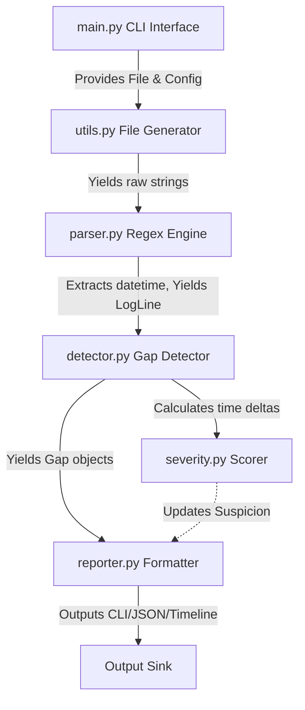

# Architecture

Tempora employs a strictly pipelined architecture tailored for scale, separation of concerns, and resilience against messy data.

## System Workflow & Data Flow

### Module Roles

1. **`main.py`**: Handles user arguments via `argparse`, orchestrates the pipeline, and bootstraps the configuration.
2. **`config.py`**: Stores default settings, parsing templates, gap thresholds, and severity boundaries.
3. **`exceptions.py`**: Consolidates custom warning and error exceptions.
4. **`utils.py`**: Exposes utility functions such as graceful time string formatting and `generate_lines` for stream feeding.
5. **`parser.py` (LogParser)**: Iterates over regex strategies. Returns fully typed `LogLine` objects containing the payload, line count, and strict datetime format.
6. **`detector.py` (GapDetector)**: Maintains internal state (`last_log_line`). For every observed `LogLine`, checks if the scalar time difference surpasses the configuration threshold. Supports ignoring intervals matching known "Safe" ranges.
7. **`severity.py`**: Evaluates scalar float durations. Assigns Enum severity tags. Uses heuristic ratios to evaluate overall document suspicion.
8. **`reporter.py` (Reporter)**: Sinks aggregated state to string or JSON. Exposes the algorithmic text-based timeline.

## Why a Streaming Approach?

Common log parsing utilities invoke `readlines()`, holding huge structures in program memory. A 10GB file causes traditional DOM-style analysis to OOM crash.

This tool employs **Generators (`yield`)**:
- Memory usage is tightly bound entirely to configuration overhead.
- Total memory usage remains static regardless of `logfile` scaling from 1 MB to 100 GB.
- Anomalies stream directly to stdout as they occur when outputting raw CLI tags.
