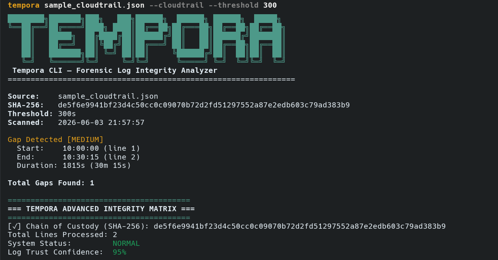

# Tempora: Automated Log Integrity Monitor



**Tempora** is a production-quality, modular forensic tool designed for security analysts to process large-scale log files and detect suspicious temporal anomalies (e.g., manipulated timestamps, missing entries, dropped connections).

It runs efficiently on GB-scale log files leveraging Python generators, identifying gaps between entries, categorizing them intelligently by severity, and providing global suspicion scores to quickly aid triage.

## Features

- **Stream Processing Strategy**: Processes logs iteratively without loading the entire file into memory, keeping the footprint minimal.
- **The Alibi Protocol (Cross-Log Sync)**: Compares primary logs against secondary/background logs to mathematically prove intentional deletion instances when time gaps match background file activities.
- **Shannon Entropy Forgery Catcher**: Dynamically calculates the informational randomness of text payloads in $O(1)$ memory. Automatically catches hackers who inject repetitive synthetic logs to mask their tracks.
- **Causality Violation Engine**: Detects reverse-time anomalies where timestamps move backwards chronologically, instantly catching out-of-order writes or systemic NTP Spoofing (Time Travel).
- **Adaptive Data-Poisoning Defense**: Freezes the rolling statistical baseline when anomalies are detected, preventing adversaries from slowly reducing system sensitivity using iterative pollution payloads.
- **Log Integrity Confidence**: Evaluates the global mathematical Trust percentage of the audit trail, degrading points for frequency of anomalies and max threshold violations.
- **Dynamic Severity Scoring**: Categorizes missing time intervals into `LOW`, `MEDIUM`, or `HIGH` severity cleanly.
- **Robust Multi-format Parsing**: Fallback strategies cleanly extract timestamps and bypass completely malformed corruption gracefully.
- **Dynamic PII Exfiltration Scanning**: Highly optimized regex sweeper catches dropped API Keys, raw IPv4 jumps, and Email accounts inline, mapping natively to MITRE T1005 data leakage thresholds.
- **JSON Configuration Matrix**: Full override support for custom time layouts and max thresholds natively without PyYAML wrappers.
- **Normalized ASCII Timeline**: Analyzes gap frequencies graphically across a relative timeline string.
- **Enterprise HTML Dashboard**: Exports a nice styled, interactive, and zero-dependency dashboard (mimicking premium SIEMs) for rapid presentation and non-technical reporting.

---

## Installation

No external dependencies are required. The tool operates using only the Python standard library.

**Option 1: Global Install via Pip (Recommended)**
Install directly from GitHub to use `tempora` as a global command-line tool anywhere on your system:
```bash
pip install git+https://github.com/EmperorsReign05/Tempora.git
tempora --help
```

**Option 2: Manual Check-out**
If you prefer running the script directly without installing:
```bash
git clone https://github.com/EmperorsReign05/Tempora.git
cd Tempora
python integrity_check.py --help
```

---

## Usage Examples

> **Note on Execution:** The examples below use the global `tempora` command (Option 1). If you installed via **Option 2** (manual check-out), simply replace `tempora` with `python integrity_check.py` in your terminal. For example: `python integrity_check.py --interactive`

**The easiest way to run the tool is using the Interactive Wizard:**
```bash
tempora --interactive
```

**Run standard analysis via CLI arguments:**
```bash
tempora sample_logs\gaps.log
```

**Run the Alibi Protocol against multiple immutable secondary logs to build consensus:**
```bash
tempora sample_logs\gaps.log --alibi sample_logs\clean.log auth.log syslog
```

**Export strict structural metrics to JSON or CSV natively (bypasses Windows formatting bugs):**
```bash
tempora sample_logs\gaps.log --format json --out report.json
tempora sample_logs\gaps.log --format csv --out anomalies.csv
```

**Generate a professional HTML Forensic Dashboard for presentation and triage:**
```bash
tempora sample_logs\gaps.log --format html --out presentation_dashboard.html
```

**Adjust the gap detection threshold (default is 60 seconds):**
```bash
tempora sample_logs\gaps.log --threshold 120
```

**Run PII Sweeping for localized MITRE T1005 Threat mapping:**
```bash
tempora sample_logs\gaps.log --scan-pii
```

**Load comprehensive layout structures via JSON configurations:**
```bash
tempora sample_logs\gaps.log --config custom_config.json
```

*Note: Changing the threshold fundamentally alters the detected gaps. For example, running `tempora logs.txt` (default 60s) might detect 3 gaps, while `tempora logs.txt --threshold 120` might detect only 2 gaps, ignoring smaller anomalies entirely.*

---

## Sample Output

```text
Gap Detected
Start: 07:53:42
End: 08:23:42
Duration: 1800 seconds

Total Gaps Found: 1

========================================
=== TEMPORA ADVANCED INTEGRITY MATRIX ===
========================================
[✓] Chain of Custody (SHA-256): 38f1fea1ce45ba7243a04e960e18b9f6c9e9c0cb0e72a5362eed4fdeb73742bc
Total Lines Processed: 103
System Status:         COMPROMISED
Log Trust Confidence:  0%

[!] INCIDENT NARRATIVE & MITRE MAPPING
The system sustained a highly sophisticated data-poisoning attack. The attacker likely spoofed NTP timestamps to mask activities, mapping to MITRE T1070.006 (Indicator Removal: Timestomp). Synthetic log payloads injected to bypass volumetric detection, mapping to MITRE T1001 (Data Obfuscation). Secondary systems successfully achieved consensus (1 background activities confirmed during gaps), cryptographically proving intentional target log manipulation. Data exfiltration risk flagged: 80 sensitive PII leakage events caught, mapping to MITRE T1005 (Data from Local System).

=== ANOMALY BREAKDOWN ===
ID: GAP-01 | 07:53:42 -> 08:23:42 (1800s)
[CAUSE]    Static threshold violated (Minimum enforced: 60s).
[ALIBI]    1 Background events contradicted silence (Consensus Failure).
[EVIDENCE] Entropy collapse computed globally for 21 instances.
[EVIDENCE] Causality violated globally 1 times.
[LEAKAGE]  PII Exfiltration filter triggered 80 times.

=== TIMELINE NORMALIZATION VISUALIZATION ===
Start: 2024-10-15 08:00:02
[x...........................................................]
End:   2024-10-15 08:23:42
Legend: [.] OK   [!] LOW gap   [x] MEDIUM gap   [X] HIGH gap
============================================
```
