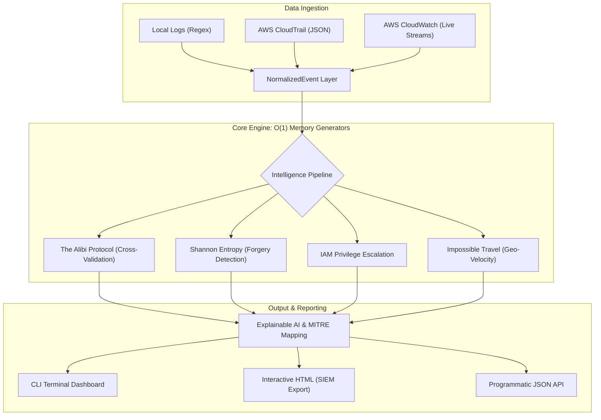

# Tempora: Cloud-Native Forensic Log Integrity Framework

[](https://badge.fury.io/py/tempora-cli)
[](https://www.python.org/downloads/)
[](https://opensource.org/licenses/MIT)


**Tempora** is an explainable forensic preprocessing and integrity verification framework for local and cloud-native audit systems. It mathematically analyzes large-scale log files, AWS CloudTrail events, and CloudWatch streams to detect structural tampering, time travel anomalies, and privilege escalation chains without relying on opaque ML models.

## Core Capabilities

- **Zero-Dependency Engine**: Tempora is built entirely on standard Python libraries. It avoids bloated dependencies and SIEM lock-in, making it perfectly suited for lightweight incident response and forensics.
- **NormalizedEvent Architecture**: Unifies raw Regex parsing and structured AWS CloudTrail JSON into a canonical format, allowing mathematical algorithms to operate agnostically across platforms.
- **The Cloud Alibi Protocol**: Cross-validates missing timeframes (gaps) in primary audit trails (e.g., CloudTrail) against secondary immutable systems (e.g., VPC Flow Logs) to cryptographically prove tampering.
- **Deterministic Cloud Intelligence**:
  - **IAM Integrity Analysis**: Detects privilege escalation chains (`CreateAccessKey`) and suspicious root activity.
  - **Impossible Travel**: Tracks IP and ASN velocity to flag physically impossible regional hopping.
  - **Causality Violation Engine**: Detects reverse-time anomalies, out-of-order writes, and NTP Spoofing.
- **Incident Narrative & MITRE Mapping**: Reconstructs anomalies into plain-English attack narratives mapped natively to MITRE ATT&CK techniques.
- **Streaming Pipeline**: Tail files in real-time or natively poll AWS CloudWatch streams with zero latency.
- **Developer API**: Import `tempora.analyze()` to integrate forensic intelligence directly into your custom data pipelines.

---

## Architecture

Tempora utilizes a highly decoupled, generator-based architecture to process gigabytes of data with $O(1)$ memory footprint. 



---

## Installation

Tempora is highly modular. You can install the zero-dependency core engine, or opt-in to AWS Cloud integrations.

**Option 1: Core Forensic Engine (Zero Dependencies)**
```bash
pip install tempora-cli
```
*(If checking out locally from source, use `pip install .`)*

**Option 2: Cloud-Native Engine (AWS Integrations)**
Installs `boto3` to unlock native CloudWatch streaming.
```bash
pip install "tempora-cli[aws]"
```
*(If checking out locally from source, use `pip install ".[aws]"`)*

---

## Developer API

Tempora exposes a stable, clean API for developers wanting to embed forensic analysis into Python pipelines:

```python
from tempora import analyze

# Analyze a local log file or CloudTrail JSON
report = analyze("cloudtrail_logs.json", min_gap_threshold=300)

# Print the visual CLI report
report.print_advanced_summary()

# Or consume the intelligence programmatically
for alert in report.cloud_alerts:
    print(alert)
```

---

## CLI Usage Guide

Tempora provides a robust Command-Line Interface out of the box.

### Cloud-Native Analysis
**Parse AWS CloudTrail JSON Logs:**
```bash
tempora audit/cloudtrail.json --cloudtrail
```

**Stream Natively from AWS CloudWatch (Requires `[aws]` install):**
```bash
tempora --aws-cloudwatch /aws/cloudtrail/production-trail
```

### Local Log Analysis
**Standard Gap Detection (Regex Local Logs):**
```bash
tempora /var/log/syslog --threshold 120
```

**Run The Alibi Protocol (Cross-Validation):**
```bash
tempora /var/log/auth.log --alibi /var/log/syslog /var/log/kern.log
```

**Live Tailing (Streaming Mode):**
```bash
tempora /var/log/auth.log --stream
```

### Forensic Exporting
Generate zero-dependency interactive HTML Dashboards or structured JSON for SIEM ingestion:
```bash
tempora sample.log --format html --out dashboard.html
tempora sample.log --format json --out results.json
```

---

## Sample Cloud Intelligence Output

```text
========================================
=== TEMPORA ADVANCED INTEGRITY MATRIX ===
========================================
[✓] Chain of Custody (SHA-256): 1d1a445a8fe2f369db4dc0bf258eafc5db80d93ec44e708b25634464d83fe8c4
Total Lines Processed: 4
System Status:         NORMAL
Log Trust Confidence:  95%

[!] INCIDENT NARRATIVE & MITRE MAPPING
Detected 1 abnormal audit silence(s) indicating potential log tampering [T1070.006 (Timestomp / Indicator Removal)]. Privilege escalation activity detected in the audit trail [T1098 (Account Manipulation)]. Impossible travel authentication anomaly detected [T1078 (Valid Accounts)]. Root account usage detected, representing a severe risk [T1078.001 (Default Accounts)].

=== CLOUD ALERTS ===
⚠️ ROOT ABUSE WARNING: AWS Root account activity detected at 2024-10-14 10:00:00 (ConsoleLogin)
⚠️ IAM ESCALATION WARNING: arn:aws:iam::123456789012:root performed CreateAccessKey at 2024-10-14 10:00:10
🚨 IMPOSSIBLE TRAVEL WARNING: arn:aws:iam::123456789012:root jumped from 192.168.1.1 to 203.0.113.5 in 0.00 hours!
⚠️ ROOT ABUSE WARNING: AWS Root account activity detected at 2024-10-14 10:20:00 (StopLogging)

=== ANOMALY BREAKDOWN ===
ID: GAP-01 | 10:00:15 -> 10:20:00 (1185s)
[CAUSE]    Static threshold violated (Minimum enforced: 60s).
```
