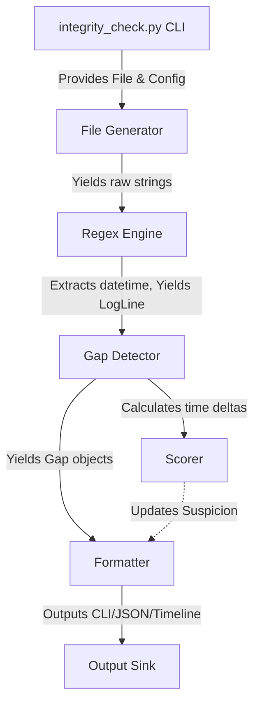

# Architecture

Tempora employs a strictly pipelined architecture tailored for scale, separation of concerns, and resilience against messy data.

## System Workflow & Data Flow

### Logic Layers (Single File Deliverable)

While Tempora is legally distributed as a single automated script (`integrity_check.py`) to conform exactly to requirements, it is architected under the hood using strict, enterprise-decoupled logic blocks.

1. **Orchestrator**: Handles user arguments via `argparse`, sets up config overrides, and initializes the pipeline loop.
2. **Configuration Block**: Stores runtime fallbacks, Regex parsing templates, default gap thresholds, and severity boundaries.
3. **LogParser Layer (Parser.py equivalent)**: Iterates over regex strategies rapidly. Generates fully typed `LogLine` objects resolving payload text and timestamps flawlessly.
4. **GapDetector Layer (Detector.py equivalent)**: Maintains internal strict mathematical state ($O(1)$ memory). Explicitly manages Causality Violations, filters Data Poisoning attacks, and runs the rolling Shannon Entropy logic.
5. **Severity Engine (Trust Framework)**: Assesses scalar float durations assigning static Severity Enum tags (`LOW`, `HIGH`). Deducts penalties according to the Mathematical Confidence degradation matrix.
6. **Reporter Layer**: Aggregates verified data structures and gracefully sinks them to the deterministic CLI string models expected by the ideathon, immediately cascading into visualization tools dynamically.

## Why a Streaming Approach?

Common log parsing utilities invoke `readlines()`, holding huge structures in program memory. A 10GB file causes traditional DOM-style analysis to OOM crash.

This tool employs **Generators (`yield`)**:
- Memory usage is tightly bound entirely to configuration overhead.
- Total memory usage remains static regardless of `logfile` scaling from 1 MB to 100 GB.
- Anomalies stream directly to stdout as they occur when outputting raw CLI tags.
