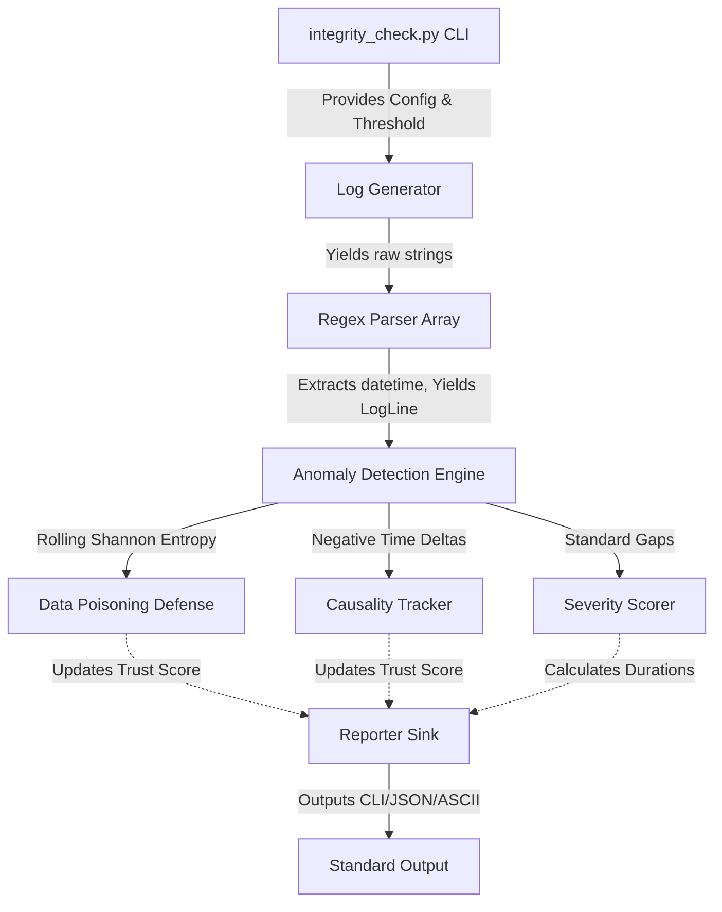

# Tempora Architecture

Tempora employs a strictly pipelined architecture tailored for scale, separation of concerns, and mathematical resilience against data poisoning.

## System Workflow & Data Flow

### Logic Modules (Single File Deliverable)

While Tempora is legally distributed as a single automated script (`integrity_check.py`) to conform perfectly to the Ideathon requirements, it is architected under the hood using strictly decoupled object-oriented logic blocks:

1. **Orchestrator (`main`)**: Handles user arguments via `argparse`, sets up config overrides, and initializes the pipeline loop. Supports Interactive Mode natively.
2. **Configuration Block (`Config`)**: Stores runtime fallbacks, Regex parsing templates (HDFS/ISO), default gap thresholds, and severity boundaries.
3. **LogParser Class**: Iterates over regex strategies rapidly. Generates fully typed `LogLine` dataclass objects natively resolving payload text and timestamps flawlessly without crashing on malformed corruption.
4. **GapDetector Class**: Maintains internal strict mathematical state ($O(1)$ memory constraint). Explicitly tracks Causality Violations, limits Time Travel, and runs the rolling Shannon Entropy logic dynamically on the string payloads.
5. **Severity Engine**: Assess duration scalars assigning static Severity Enum tags (`LOW`, `HIGH`). Deducts Trust Confidence penalties based on Alibi failures and Entropy limits.
6. **Reporter Class**: Aggregates verified anomalies and gracefully sinks them to the deterministic string models required, executing the visual ASCII timeline, robust JSON/CSV pipelines, and rendering the highly structured HTML forensic dashboard.

## Stream Processing Strategy

Common log parsing utilities invoke `readlines()`, holding huge structures in program memory. A 10GB file causes traditional DOM-style analysis to OOM crash.

Tempora strictly employs **Generators (`yield`)**, ensuring memory usage remains statically bound entirely to configuration overhead. A 500GB server log runs on the exact same micro-footprint of RAM as a 50KB text file.
